# QualMeters Oy — Website Sitemap, Copy Deck and Visual Asset Guide

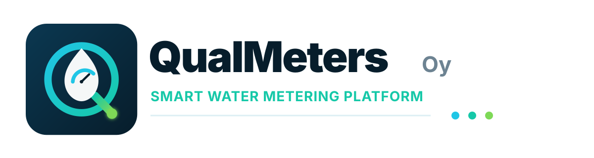

**Website purpose:** position QualMeters Oy as an enterprise-grade provider of wireless water metering systems for housing companies, municipalities, cities, developers and property portfolios.

**Company address:** QualMeters Oy, Muonamiehentie 11, 00390 Helsinki, Finland.

**Primary sales CTA across the site:** **Request a demo**
**Secondary CTA:** **Talk to a metering specialist**
**Recommended global background:** 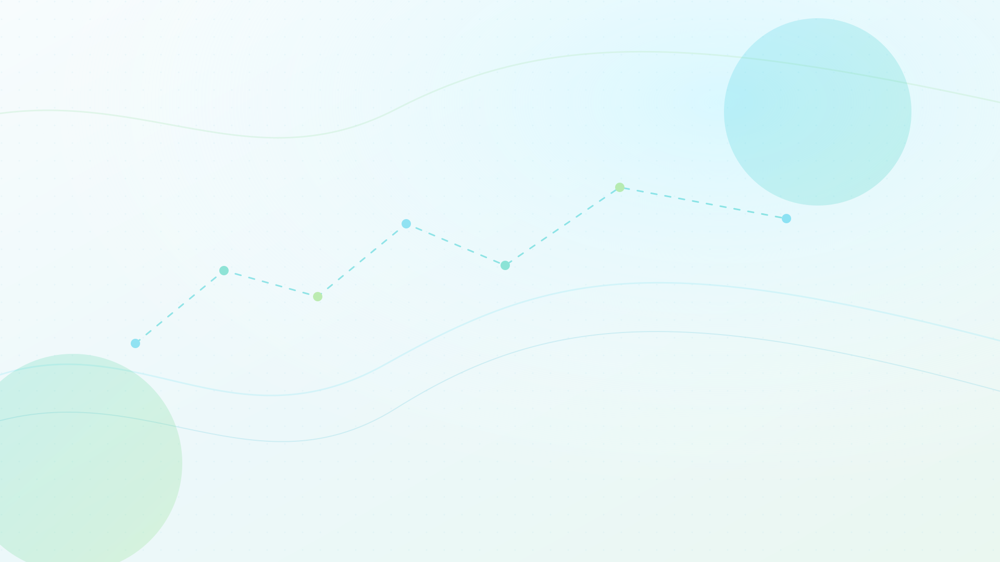

---

## 1. Brand Foundation

### Core positioning

**QualMeters is a smart water metering platform that connects MID-certified ultrasonic water meters, building-level gateways, NB-IoT devices, resident portals and organization-grade REST APIs into one managed water intelligence system.**

The system is designed for organizations that need accurate apartment-level water data, fair billing, remote meter reading, leak awareness, resident transparency and scalable integrations without building the full metering technology stack themselves.

### Main value promise

**Measure water accurately. See consumption clearly. Act before waste becomes cost.**

QualMeters brings together reliable ultrasonic water meters, wireless connectivity and a modern cloud platform so every stakeholder can use water data in the right way: residents understand their own consumption, housing companies improve transparency, and municipalities gain operational insight through dashboards and REST APIs.

### Boilerplate copy

QualMeters Oy provides a managed smart water metering system for residential buildings, municipalities and property portfolios. The platform combines MID-certified ultrasonic water meters, Wireless M-Bus, Modbus and NB-IoT connectivity, optional building gateway infrastructure, a secure cloud data platform, resident self-service portals and REST API access for organizational systems. QualMeters helps customers reduce manual reading work, improve billing readiness, detect abnormal consumption and promote more sustainable water use.

### Tone of voice

Use a confident, corporate and infrastructure-grade tone. Avoid start-up hype. The message should feel credible for a large housing company board, city utility, property manager, developer or public procurement team.

Recommended tone words: **reliable, managed, scalable, accurate, secure, transparent, interoperable, sustainable, operational.**

### Visual identity direction

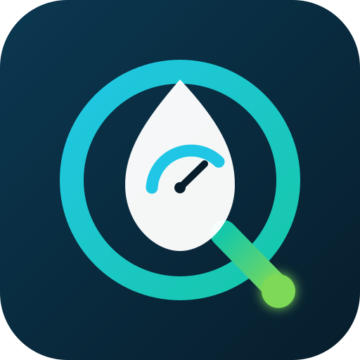

The visual language should combine water, measurement and data intelligence. Use deep navy for trust and infrastructure, aqua/teal for water and connectivity, and green for sustainability. Illustrations should feel like enterprise platform diagrams rather than playful consumer app artwork.

---

## 2. Visual Asset Index

Use these assets as the first illustration set for the site. SVG is recommended for the website; PNG files with the same names are included as fallbacks.

| Asset | Recommended use |
|---|---|
| `assets/qualmeters-logo.svg` | Logo mark, favicon concept, square social avatar |
| `assets/qualmeters-logo-horizontal.svg` | Header logo, footer logo, sales decks |
| `assets/site-background.svg` | Subtle global page background |
| `assets/hero-smart-water-network.svg` | Home page hero and corporate overview |
| `assets/system-architecture.svg` | Platform overview, gateway deployment, NB-IoT direct model |
| `assets/connectivity-protocols.svg` | Connectivity and protocol pages |
| `assets/ultrasonic-meter-pair.svg` | Meter hardware, new buildings, apartment metering |
| `assets/resident-portal-qr.svg` | Resident portal and QR access flow |
| `assets/utility-dashboard-api.svg` | Organization dashboards, REST API, municipal use |
| `assets/leak-guard.svg` | Leak detection, abnormal consumption, alerts |
| `assets/sustainability-benchmarking.svg` | Sustainability, water saving and benchmarking |
| `assets/deployment-lifecycle.svg` | Installation, commissioning and managed operations |
| `assets/security-governance.svg` | Security, compliance and data governance |
| `assets/contact-sales-channel.svg` | Contact page and enterprise demo CTA |

---

## 3. Recommended Sitemap

| URL | Page | Primary audience | Primary conversion | Recommended image |
|---|---|---|---|---|
| `/` | Home | All buyers | Request a demo | `hero-smart-water-network.svg` |
| `/platform` | Platform overview | Decision makers, technical evaluators | Explore architecture | `system-architecture.svg` |
| `/platform/connectivity` | Connectivity | Technical buyers, integrators | Discuss integration | `connectivity-protocols.svg` |
| `/meters` | Ultrasonic water meters | Housing companies, developers, procurement | Plan a meter rollout | `ultrasonic-meter-pair.svg` |
| `/gateway` | Building gateway | Technical evaluators, property managers | Assess gateway deployment | `system-architecture.svg` |
| `/cloud-platform` | Cloud data platform | Organizations, municipalities | Book platform demo | `utility-dashboard-api.svg` |
| `/rest-api` | REST API | Cities, municipalities, ERP/billing teams | Request API documentation | `utility-dashboard-api.svg` |
| `/resident-portal` | Resident portal | Housing companies, residents | View resident experience | `resident-portal-qr.svg` |
| `/leak-guard` | Leak Guard | Property managers, utilities, residents | Activate alerting | `leak-guard.svg` |
| `/sustainability` | Sustainable water use | ESG, boards, municipalities | Discuss conservation goals | `sustainability-benchmarking.svg` |
| `/solutions/housing-companies` | Housing companies | Boards, property managers | Request building assessment | `ultrasonic-meter-pair.svg` |
| `/solutions/cities-municipalities` | Cities and municipalities | Utilities, public-sector buyers | Request API/data consultation | `utility-dashboard-api.svg` |
| `/solutions/new-developments` | New apartment buildings | Developers, MEP designers | Plan early specification | `ultrasonic-meter-pair.svg` |
| `/solutions/property-portfolios` | Property portfolios | Portfolio owners, facility managers | Start portfolio pilot | `sustainability-benchmarking.svg` |
| `/deployment` | Deployment and operations | Buyers, technical stakeholders | Plan implementation | `deployment-lifecycle.svg` |
| `/security` | Security and governance | IT, data protection, procurement | Review security model | `security-governance.svg` |
| `/about` | About QualMeters | All visitors | Build trust | `qualmeters-logo-horizontal.svg` |
| `/contact` | Contact | All buyers | Submit sales inquiry | `contact-sales-channel.svg` |
| `/faq` | FAQ | All visitors | Reduce uncertainty | `system-architecture.svg` |

---

# 4. Page Copy

## 4.1 `/` — Home

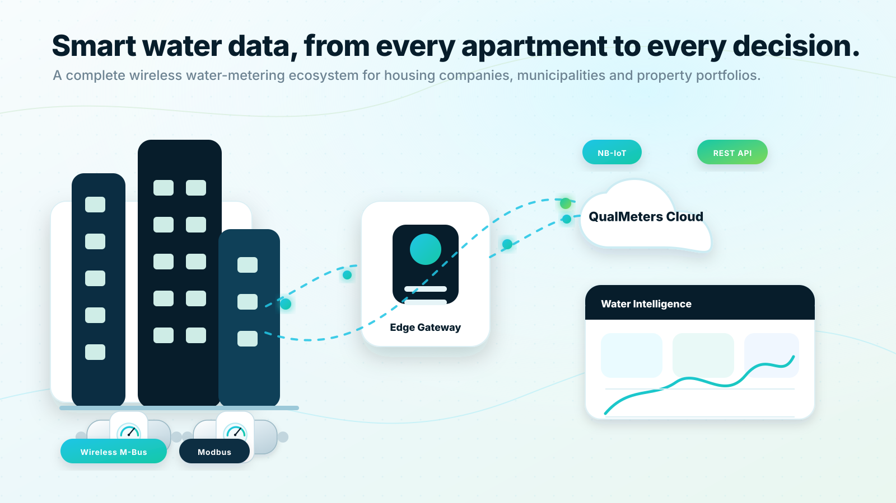

**SEO title:** QualMeters Oy | Smart Water Metering Platform for Buildings and Municipalities
**Meta description:** QualMeters provides a managed wireless water metering system with MID-certified ultrasonic meters, gateway and NB-IoT connectivity, resident portals, leak alerts and REST API access.

### Hero

**Eyebrow:** Smart water metering for buildings, cities and portfolios

**H1:** Water intelligence from every meter to every decision.

**Hero body:** QualMeters connects MID-certified ultrasonic water meters, wireless communication, resident self-service and organization-grade data APIs into one managed platform. Replace manual reading with reliable water data that supports fair billing, leak awareness, sustainability and smarter operations.

**Primary CTA:** Request a demo
**Secondary CTA:** Explore the platform

**Hero proof points:**

- MID-certified ultrasonic water meters for cold and warm water applications
- Wireless M-Bus, Modbus and NB-IoT connectivity options
- Building gateway or direct-to-cloud NB-IoT deployment
- Resident portal with QR-based meter access
- REST API for cities, municipalities and housing companies

### Section: One complete system, not separate components

**H2:** From meter hardware to usable water data.

Water metering projects often fail when meters, communication, software and integrations are treated as separate purchases. QualMeters is designed as a complete system: field devices are connected, readings are normalized, alarms are managed, and authorized users receive the data through portals, dashboards and APIs.

**Feature cards:**

**Accurate apartment-level measurement**
Use ultrasonic water meters for reliable measurement without traditional mechanical moving parts. New apartment buildings can be specified with separate cold and warm water meters per apartment.

**Flexible data collection**
Collect meter data through a local building gateway using Wireless M-Bus, Modbus and other common protocols, or use NB-IoT meters that communicate directly with the QualMeters cloud.

**Resident transparency**
Residents can scan the QR code on their meter, verify access by entering the current reading and view their own consumption in a clear portal.

**Operational integrations**
Cities, municipalities, housing companies and property platforms can retrieve meter readings, alerts and status information through a REST API.

### Section: Designed for the stakeholders around water data

**H2:** Every user gets the right view.

**For residents:** Understand daily and monthly consumption, receive leak notifications and compare usage against relevant peer groups when enough profile information is provided.

**For housing companies:** Improve fairness, reduce manual meter reading, support transparent cost allocation and detect abnormal apartment-level consumption earlier.

**For municipalities and cities:** Access real-time and interval-based water data through dashboards and APIs for demand insight, billing workflows, operational monitoring and long-term planning.

**For property portfolios:** Standardize water data across many buildings and detect waste patterns that would otherwise remain hidden until the next manual reading cycle.

### Section: Green values built into the product

**H2:** Make water use visible, comparable and easier to improve.

Water efficiency starts with visibility. QualMeters helps residents and organizations see consumption trends, identify unusual usage and understand how daily choices affect water demand. The platform supports optional comparison features: when residents add context such as household size, the system can provide more meaningful benchmarks against similar users.

**CTA block:**

**Headline:** Ready to design a smarter water metering rollout?
**Body:** Tell us about your buildings, meter count, communication requirements and integration needs. QualMeters will help you evaluate the right deployment model.
**Button:** Request a demo

---

## 4.2 `/platform` — Platform Overview

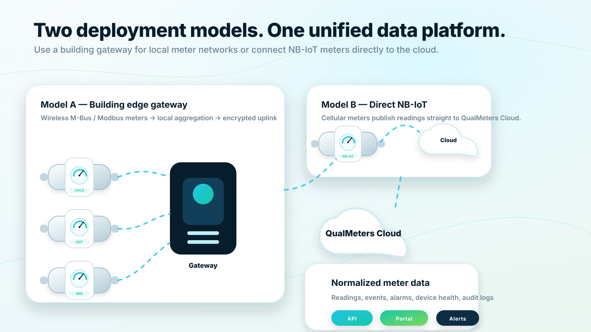

**SEO title:** QualMeters Platform | Wireless Water Metering Architecture
**Meta description:** Explore the QualMeters smart water metering platform: ultrasonic meters, gateway collection, NB-IoT direct communication, cloud analytics, resident portals and REST APIs.

### Hero

**Eyebrow:** Platform overview

**H1:** Two deployment models. One unified water data platform.

**Hero body:** QualMeters supports both building-level data aggregation and direct NB-IoT meter communication. In both cases, meter readings are normalized into a secure cloud platform that powers resident portals, organization dashboards, alerts and REST API integrations.

**Primary CTA:** See the architecture
**Secondary CTA:** Discuss your deployment model

### Section: Model A — Building gateway deployment

In apartment buildings and dense property environments, a local gateway can collect data from meters using Wireless M-Bus, Modbus and other supported protocols. The gateway forwards normalized data securely to the QualMeters cloud while also supporting local diagnostics and store-and-forward resilience.

**Use this model when:**

- Many apartment meters are installed in one building or campus
- Wireless M-Bus or wired Modbus devices are preferred
- Local data concentration improves coverage or cost efficiency
- The property owner wants centralized building-level device management

### Section: Model B — Direct NB-IoT deployment

With NB-IoT meters, each meter can send readings directly to the QualMeters cloud over a cellular low-power wide-area network. This can reduce the need for building-level infrastructure and is useful when direct coverage is available and the meter estate is geographically distributed.

**Use this model when:**

- Meters have integrated NB-IoT communication
- Buildings are distributed across a wide area
- A gateway installation is unnecessary or impractical
- The project benefits from cellular coverage and direct device onboarding

### Section: A common data model for every reading

Regardless of how the reading arrives, the platform stores data in a common structure: meter identity, apartment or property association, timestamp, volume, temperature class, communication source, reading quality, alarm state and device health. This keeps dashboards, APIs and resident portals independent from the communication technology used in the field.

### Section: Platform capabilities

**Meter data management:** Device registry, meter lifecycle, readings, alarms, metadata and audit trail.

**Resident experience:** QR-based access, current-reading verification, consumption graphs, alerts and comparison features.

**Organization tools:** Property dashboards, fleet health, leak indicators, exports, API access and alert management.

**Integration layer:** REST API, webhook-ready event model, billing exports and additional protocol adapters.

**Security foundation:** Tenant separation, role-based access, encrypted data transport and structured audit logging.

### CTA

**Headline:** Need to choose between gateway and NB-IoT?
**Body:** QualMeters can map your building types, meter locations, protocol requirements and data needs into a recommended architecture.
**Button:** Request architecture consultation

---

## 4.3 `/platform/connectivity` — Connectivity

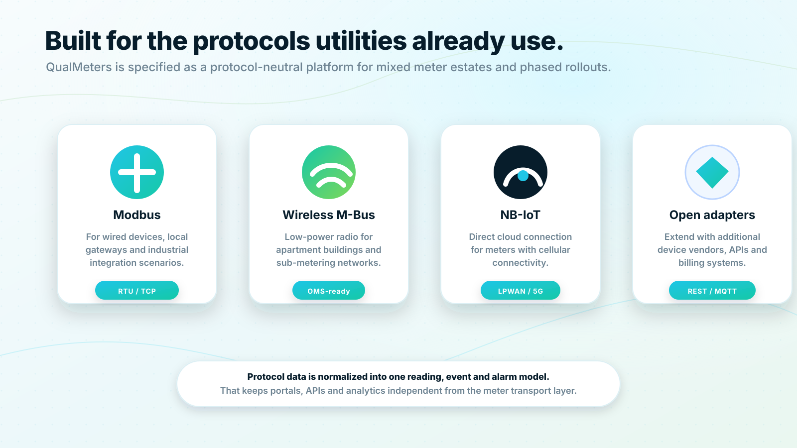

**SEO title:** QualMeters Connectivity | Modbus, Wireless M-Bus, NB-IoT and REST Integrations
**Meta description:** QualMeters supports common water metering connectivity models including Modbus, Wireless M-Bus, NB-IoT and REST API integrations.

### Hero

**Eyebrow:** Connectivity

**H1:** Built for the communication technologies already used in water metering.

**Hero body:** Smart metering projects rarely start from a blank slate. QualMeters is designed as a protocol-neutral platform that can support Wireless M-Bus, Modbus, NB-IoT and future adapters while presenting one clean data model to users and integrations.

### Section: Wireless M-Bus

Wireless M-Bus is a natural choice for apartment-level sub-metering environments where many low-power meters need to be read within the same property. A building gateway can collect meter frames and forward data to the QualMeters platform.

**Website feature copy:**

Use Wireless M-Bus to collect apartment-level readings without opening every meter location manually. QualMeters converts radio meter data into usable readings, event states and device status for dashboards, resident portals and APIs.

### Section: Modbus

Modbus is widely used in building automation and industrial metering contexts. QualMeters can be specified to use Modbus through the building gateway for devices that require wired or local bus integration.

**Website feature copy:**

Connect compatible wired devices and local metering infrastructure through Modbus. QualMeters can normalize these readings into the same cloud data model used by wireless and NB-IoT meters.

### Section: NB-IoT

NB-IoT provides a direct cellular path for meters that are equipped with compatible modules. It is especially useful when a building gateway is not desired or when meters are spread across many locations.

**Website feature copy:**

Deploy NB-IoT meters where direct-to-cloud connectivity is the best operational model. Readings are transmitted to the QualMeters cloud and made available to authorized systems through dashboards, portals and APIs.

### Section: REST API

Connectivity does not stop at the meter. QualMeters also provides organization-grade access through REST APIs so water data can flow into billing systems, ERP environments, municipal platforms and analytics tools.

**CTA:** Request API and connectivity planning

---

## 4.4 `/meters` — Ultrasonic Water Meters

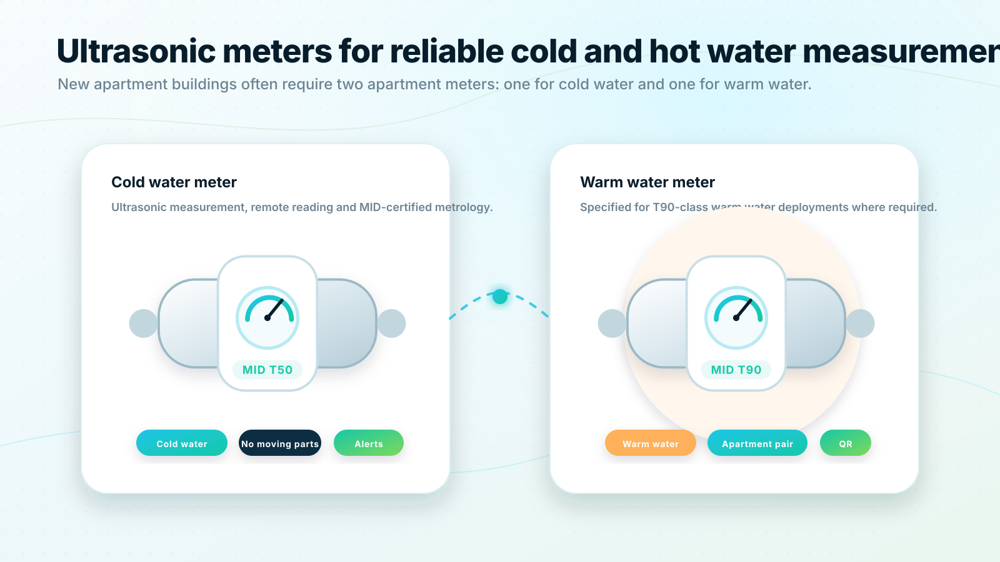

**SEO title:** MID-Certified Ultrasonic Water Meters | QualMeters Oy
**Meta description:** QualMeters uses MID-certified ultrasonic water meters for apartment-level cold and warm water measurement, including T50 and T90 temperature-class deployments.

### Hero

**Eyebrow:** Meter hardware

**H1:** MID-certified ultrasonic water meters for modern building metering.

**Hero body:** QualMeters is built around ultrasonic water meters with MID certification and T50/T90 temperature-class deployment options. In new apartment buildings, a typical specification often includes two meters per apartment: one for cold water and one for warm water.

**Primary CTA:** Plan a meter rollout
**Secondary CTA:** Ask about meter compatibility

### Section: Why ultrasonic metering?

Ultrasonic meters measure flow electronically rather than relying on a traditional mechanical measuring mechanism. For digital metering systems, this makes them well suited for remote reading, interval data collection and long-term monitoring.

**Website copy:**

QualMeters specifies ultrasonic water meters for reliable apartment-level data. The meters become part of a connected system: each meter can be identified, read remotely, associated with an apartment or property, and monitored through the cloud platform.

### Section: Cold and warm water measurement

Modern apartment buildings commonly need separate measurement for cold and warm water. QualMeters supports this model by structuring the platform around apartment-level meter pairs, meter metadata and clear resident-facing consumption views.

**Feature copy:**

**Cold water meter:** T50-class metering for cold water applications.
**Warm water meter:** T90-class metering for warm water applications where specified.
**Apartment pair model:** View cold and warm water consumption together in dashboards and resident portals.
**QR identity:** Each meter includes a QR code that can open the correct meter view for the resident access process.

### Section: Meter lifecycle

The meter is not only hardware. It needs a lifecycle record: installation date, serial number, MID data, temperature class, apartment association, communication method, firmware information, reading schedule and maintenance status.

QualMeters maintains this lifecycle information so organizations can track device status, plan replacements and keep metering data trustworthy over time.

### CTA

**Headline:** Specify the right meters before construction or renovation starts.
**Body:** QualMeters can support early planning for new buildings, retrofit projects and portfolio-wide meter standardization.
**Button:** Talk to a metering specialist

---

## 4.5 `/gateway` — Building Gateway


**SEO title:** Building Gateway for Wireless Water Metering | QualMeters Oy
**Meta description:** QualMeters building gateways collect meter data from local Wireless M-Bus and Modbus networks and securely forward readings to the cloud platform.

### Hero

**Eyebrow:** Building edge infrastructure

**H1:** A local gateway that turns building meter networks into cloud data.

**Hero body:** For many housing companies and apartment buildings, the most efficient architecture is a building-level gateway. It collects meter readings from local devices, monitors communication health and forwards data to the QualMeters cloud for portals, alerts and integrations.

### Section: What the gateway does

The gateway acts as the bridge between field meters and cloud intelligence. It supports local protocol adapters, secure uplink communication, device health reporting, buffered transmission and remote diagnostics.

**Feature copy:**

**Local collection:** Receive readings from Wireless M-Bus and Modbus devices.
**Secure uplink:** Forward meter data to QualMeters using encrypted communication.
**Store and forward:** Buffer readings during temporary connection interruptions.
**Remote diagnostics:** Monitor gateway availability, device communication and data freshness.
**Lifecycle management:** Support installation validation, firmware updates and maintenance workflows.

### Section: Best-fit environments

A gateway deployment is especially useful in apartment buildings with many meters, basement meter locations, mixed communication technologies or a need for centralized property-level management.

### CTA

**Headline:** Unsure whether your site needs a gateway?
**Body:** We can evaluate meter count, building layout, protocol requirements and network coverage to recommend the right collection model.
**Button:** Request site assessment

---

## 4.6 `/cloud-platform` — Cloud Data Platform

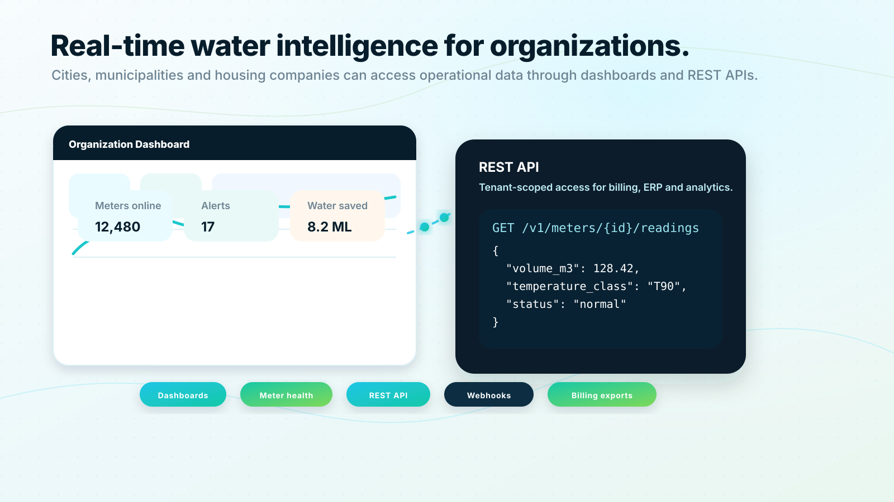

**SEO title:** Cloud Water Meter Data Platform | QualMeters Oy
**Meta description:** The QualMeters cloud platform stores, normalizes and delivers water meter data through dashboards, resident portals, alerts and REST APIs.

### Hero

**Eyebrow:** Cloud platform

**H1:** A single source of truth for water meter data.

**Hero body:** QualMeters Cloud receives meter readings from gateways and NB-IoT devices, validates and normalizes the data, and makes it available to authorized users through dashboards, portals, alerts and APIs.

### Section: Data that organizations can trust

The platform does more than store numbers. It connects meter identity, property hierarchy, apartment association, reading quality, alarm states and communication health. This enables better operational decisions and cleaner integrations.

### Section: Key platform modules

**Meter registry:** Maintain all meters, serial numbers, installation locations, temperature classes and communication settings.

**Reading engine:** Store interval readings, latest values, estimated states, duplicate detection and data quality markers.

**Alert engine:** Detect abnormal consumption, continuous flow, communication silence and device events.

**Portal layer:** Provide different views for residents, housing companies, municipalities, support teams and administrators.

**API layer:** Serve readings, alerts and device status to external systems using secure REST endpoints.

**Reporting layer:** Export data for billing, compliance support, water saving programs and portfolio analysis.

### CTA

**Headline:** Turn meter readings into operational intelligence.
**Body:** See how the QualMeters platform can support your buildings, residents and integrations.
**Button:** Book platform demo

---

## 4.7 `/rest-api` — REST API


**SEO title:** Water Meter REST API | QualMeters Oy
**Meta description:** QualMeters provides REST API access to water meter readings, alerts, meter metadata and device health for cities, municipalities and housing companies.

### Hero

**Eyebrow:** Data access

**H1:** REST API access for real water operations.

**Hero body:** Cities, municipalities, housing companies and portfolio owners can retrieve water meter data directly from QualMeters. The API is designed to support billing workflows, operational dashboards, municipal systems, property platforms and analytics.

**Primary CTA:** Request API documentation
**Secondary CTA:** Discuss integration scope

### Section: API use cases

**Billing and cost allocation:** Retrieve readings by property, apartment, meter and time period.

**Municipal water insight:** Access consumption data for planning, reporting and demand analysis.

**Property dashboards:** Integrate water consumption and alert states into existing property management systems.

**Leak workflows:** Pull alerts into maintenance ticketing tools or notification systems.

**Data exports:** Support CSV, Excel and scheduled exports for teams that are not ready for full API integration.

### Section: Endpoint model

The public API is versioned and tenant-scoped.

```text
GET /v1/meters
GET /v1/meters/{meterId}
GET /v1/meters/{meterId}/readings
GET /v1/properties/{propertyId}/readings
GET /v1/apartments/{apartmentId}/consumption-summary
GET /v1/alerts
GET /v1/device-health
POST /v1/webhooks
```

### Section: Recommended API principles

**Security:** OAuth 2.0 client credentials, tenant separation and role-based scopes.
**Reliability:** Pagination, idempotency keys where relevant, clear retry behavior and API status monitoring.
**Data quality:** Reading quality flags, source timestamps, received timestamps and estimated reading markers.
**Interoperability:** JSON responses, stable versioning, webhooks and export options.
**Auditability:** API access logs and traceability for sensitive operations.

### CTA

**Headline:** Bring QualMeters data into your existing systems.
**Body:** Our integration planning starts with your systems, required data fields and operational workflow.
**Button:** Request API consultation

---

## 4.8 `/resident-portal` — Resident Portal

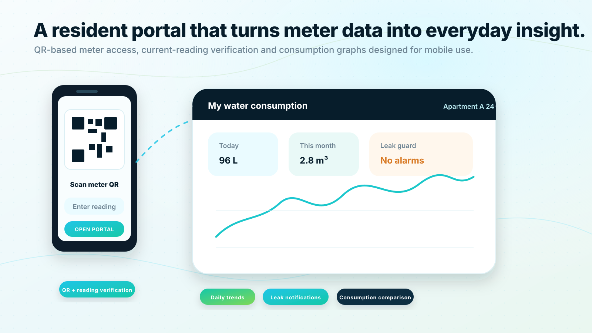

**SEO title:** Resident Water Consumption Portal | QualMeters Oy
**Meta description:** QualMeters resident portal lets users view their own water consumption, scan a meter QR code, verify with the current reading and receive leak alerts.

### Hero

**Eyebrow:** Resident transparency

**H1:** Let residents see the water they use.

**Hero body:** The QualMeters resident portal gives residents a simple way to understand their own water consumption. Each meter can be opened through a QR code, and access is verified by entering the current meter reading.

**Primary CTA:** View resident experience
**Secondary CTA:** Talk about resident onboarding

### Section: QR-based meter access

Each meter includes a QR code. When the resident scans the code, the correct meter view opens. The user then enters the current visible reading from the meter, which is used as a possession-based verification step.

**Website copy:**

No complex setup is needed for first access. The resident scans the meter, confirms the current reading and begins viewing consumption in a clear, mobile-first interface.

**Access hardening:** QR code plus current reading verification is rate-limited and can be strengthened with tenant invitations, property manager approval or account-based unit association when higher assurance is required.

### Section: What residents can see

**Consumption history:** Daily, weekly, monthly and yearly trends.
**Cold and warm water:** Separate and combined views when apartments have two meters.
**Leak indicators:** Alerts for continuous flow, abnormal usage and sudden spikes.
**Comparison:** Optional benchmark views against similar households when enough profile information is provided.
**Tips:** Practical guidance to reduce consumption and detect waste.

### Section: Better comparisons with better context

Residents can choose to add information such as household size. The system can then provide more relevant comparison data, for example comparing a two-person household with similar households rather than with the entire building average.

Privacy must be central. Benchmarking uses aggregated and anonymized peer groups so residents receive useful insight without exposing individual neighbors.

### CTA

**Headline:** Give residents transparency without adding manual work.
**Body:** QualMeters can help housing companies introduce digital water visibility in a way that is simple, secure and understandable.
**Button:** Discuss resident portal rollout

---

## 4.9 `/leak-guard` — Leak Guard

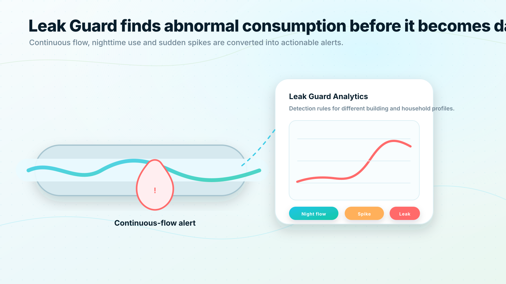

**SEO title:** Water Leak Detection and Abnormal Consumption Alerts | QualMeters Oy
**Meta description:** QualMeters Leak Guard helps identify continuous flow, abnormal consumption and suspicious water-use patterns using smart meter data.

### Hero

**Eyebrow:** Leak awareness

**H1:** Detect abnormal water use before it becomes expensive damage.

**Hero body:** Leak Guard turns meter readings into actionable alerts. The system can detect continuous flow, nighttime consumption, unexpected spikes and device events so residents and property managers can respond earlier.

### Section: Why leak awareness matters

A small hidden leak can continue for days or weeks if water consumption is not visible. With remote readings and automated rules, QualMeters helps turn unusual consumption into a visible event.

### Section: Detection concepts

**Continuous flow:** The system sees that water use does not return to zero during expected quiet periods.
**Nighttime usage:** Repeated night consumption patterns can indicate a leak or running fixture.
**Sudden spike:** A sharp increase compared with baseline use can trigger review.
**Meter silence:** Missing readings or communication failures can be handled as operational alerts.
**Peer anomaly:** Consumption that differs strongly from similar households can be highlighted with care.

### Section: Alert workflow

1. Meter data arrives through gateway or NB-IoT.
2. The platform compares the reading pattern against configured thresholds and historical behavior.
3. A potential leak or abnormal pattern is classified.
4. The resident, property manager or organization dashboard receives an alert based on configured responsibility rules.
5. The event is tracked until acknowledged or resolved.

### CTA

**Headline:** Make leak awareness part of everyday water management.
**Body:** Use QualMeters to create an alerting process that supports residents, property managers and municipal stakeholders.
**Button:** Explore Leak Guard

---

## 4.10 `/sustainability` — Sustainability

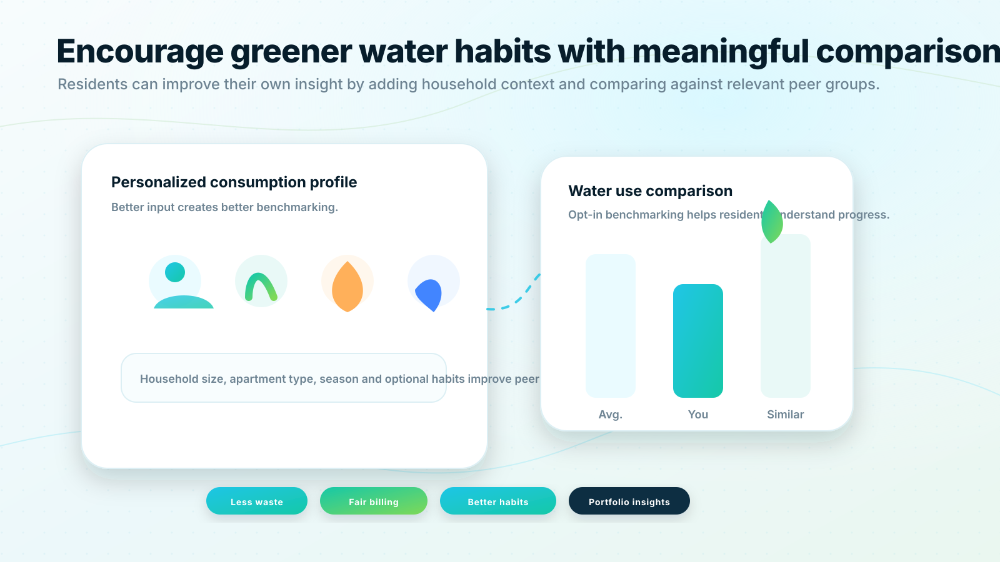

**SEO title:** Sustainable Water Use and Consumption Benchmarking | QualMeters Oy
**Meta description:** QualMeters supports greener water habits with consumption visibility, leak awareness, resident benchmarking and portfolio-level water insights.

### Hero

**Eyebrow:** Sustainable water intelligence

**H1:** Make water efficiency visible, measurable and motivating.

**Hero body:** QualMeters supports greener water use by giving residents and organizations the data they need to understand consumption, detect waste and compare progress over time.

### Section: Visibility changes behavior

When residents only see water costs after the fact, it is difficult to connect daily choices with total consumption. QualMeters makes water use visible through understandable charts, comparisons and alerts.

### Section: Better benchmarking

Simple building averages can be misleading. QualMeters lets residents add optional context, such as household size, so comparisons become more meaningful. A single-person household is not evaluated in the same way as a family of five.

### Section: Sustainability features

**Personal consumption trends:** Clear views of water use over time.
**Household-aware comparison:** More accurate peer groups when users add context.
**Leak reduction:** Early detection supports reduced waste and lower risk of water damage.
**Portfolio reporting:** Organizations can compare buildings and identify improvement opportunities.
**Resident education:** Practical tips can be shown where they are most relevant.

### CTA

**Headline:** Turn sustainability goals into measurable water actions.
**Body:** QualMeters can support conservation programs, resident engagement and ESG reporting with reliable consumption data.
**Button:** Discuss sustainability goals

---

## 4.11 `/solutions/housing-companies` — Housing Companies


**SEO title:** Smart Water Metering for Housing Companies | QualMeters Oy
**Meta description:** QualMeters helps housing companies digitize apartment-level water metering with ultrasonic meters, resident portals, leak alerts and fair consumption data.

### Hero

**Eyebrow:** Solution for housing companies

**H1:** Fairer water data for every apartment.

**Hero body:** QualMeters helps housing companies move from manual meter reading toward transparent, connected and resident-friendly water metering. The platform supports apartment-level meters, resident access, leak alerts and data exports for billing and property management.

### Section: Challenges QualMeters addresses

**Manual reading burden:** Reduce the time and coordination needed for meter reading.
**Limited resident visibility:** Give residents a clear view of their own consumption.
**Leak risk:** Detect abnormal consumption before it grows into a larger issue.
**Billing transparency:** Support fairer cost allocation with apartment-level data.
**Renovation complexity:** Plan meters, gateways and communication before installation starts.

### Section: Recommended package

**Meters:** MID-certified ultrasonic water meters for cold and warm water.
**Connectivity:** Wireless M-Bus or Modbus via building gateway; NB-IoT where direct communication is preferred.
**Resident portal:** QR access, consumption history, leak indicators and comparison features.
**Organization dashboard:** Building overview, meter list, alert view and export tools.
**Operations:** Commissioning support, data monitoring and maintenance processes.

### CTA

**Headline:** Start with one building or plan the entire housing company portfolio.
**Button:** Request housing company assessment

---

## 4.12 `/solutions/cities-municipalities` — Cities and Municipalities


**SEO title:** Smart Water Metering for Cities and Municipalities | QualMeters Oy
**Meta description:** QualMeters gives cities and municipalities real-time water meter data, REST API access, leak insight and scalable smart metering deployment models.

### Hero

**Eyebrow:** Solution for cities and municipalities

**H1:** Water meter data your municipal systems can use.

**Hero body:** QualMeters provides cities and municipalities with a scalable way to access water consumption data across buildings, residents and properties. Dashboards and REST APIs support operational insight, billing workflows, water demand visibility and sustainability programs.

### Section: What public-sector buyers need

Municipal water data must be reliable, secure, integrated and maintainable. QualMeters is structured to support large meter estates, multiple deployment models, standardized APIs and clear operational processes.

### Section: Municipal use cases

**Remote reading:** Reduce the need for manual readings and site visits.
**Demand insight:** Understand consumption patterns across neighborhoods, properties and time periods.
**Leak awareness:** Detect abnormal usage and support faster response.
**API integration:** Connect meter data with municipal billing, customer service and analytics systems.
**Resident engagement:** Provide residents with clear consumption visibility and conservation tools.

### CTA

**Headline:** Build a municipal water data layer that can scale.
**Button:** Request municipal consultation

---

## 4.13 `/solutions/new-developments` — New Apartment Buildings


**SEO title:** Water Metering for New Apartment Buildings | QualMeters Oy
**Meta description:** QualMeters supports developers and MEP designers with smart water metering specifications for new apartment buildings, including cold and warm water meter pairs.

### Hero

**Eyebrow:** Solution for new developments

**H1:** Specify smart water metering before the building is finished.

**Hero body:** New apartment buildings are the best place to design water metering correctly from the beginning. QualMeters supports cold and warm water meter pairs, wireless communication planning, gateway placement, resident onboarding and data integration requirements.

### Section: Why early specification matters

Meter locations, wireless coverage, electrical supply, gateway placement and data requirements are considered before installation. Early planning helps reduce rework and supports reliable data collection from day one.

### Section: Development checklist

**Meter plan:** Cold and warm water meters per apartment where required.
**Communication plan:** Wireless M-Bus, Modbus, NB-IoT or mixed architecture.
**Gateway placement:** Power, network access, radio coverage and maintenance access.
**Digital handover:** Meter serial numbers, apartment mapping and commissioning data.
**Resident onboarding:** QR access, instructions and support materials.
**Integration scope:** Billing, property management and municipal reporting needs.

### CTA

**Headline:** Include smart water metering in the technical specification.
**Button:** Plan a new development rollout

---

## 4.14 `/solutions/property-portfolios` — Property Portfolios


**SEO title:** Water Metering for Property Portfolios | QualMeters Oy
**Meta description:** QualMeters helps property owners standardize water data across buildings, detect waste and compare consumption across portfolios.

### Hero

**Eyebrow:** Solution for property portfolios

**H1:** Standardize water intelligence across every property.

**Hero body:** Portfolio owners need comparable data across different buildings, meter generations and communication environments. QualMeters helps create a consistent water data layer that supports monitoring, leak awareness, benchmarking and reporting.

### Section: Portfolio value

**Comparable consumption:** View building-level and apartment-level patterns in one system.
**Prioritized action:** Identify properties with abnormal consumption or repeated alerts.
**Operational consistency:** Standardize meter lifecycle, data access and reporting.
**Sustainability tracking:** Measure improvements and communicate progress.
**Phased deployment:** Start with priority buildings and expand in a controlled rollout.

### CTA

**Headline:** Start with a portfolio pilot and scale with evidence.
**Button:** Discuss portfolio rollout

---

## 4.15 `/deployment` — Deployment and Operations

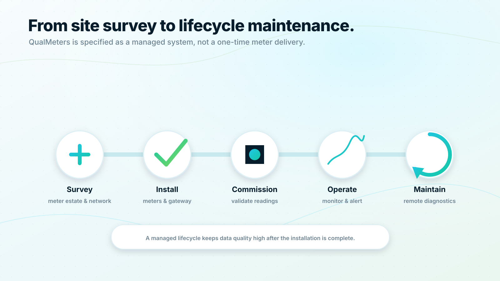

**SEO title:** Smart Water Meter Deployment and Operations | QualMeters Oy
**Meta description:** QualMeters supports water meter deployment from site survey and installation to commissioning, monitoring, maintenance and lifecycle management.

### Hero

**Eyebrow:** Deployment and managed operations

**H1:** A metering system is only as good as its rollout.

**Hero body:** QualMeters is designed as a managed system. Successful projects require meter planning, communication validation, commissioning, data quality monitoring and ongoing operational support.

### Section: Deployment phases

**1. Site survey:** Understand building layout, meter locations, protocols, network conditions and integration needs.

**2. Meter and gateway plan:** Choose meter types, cold and warm water requirements, gateway placement and communication architecture.

**3. Installation:** Install meters, gateways and required connectivity according to the approved plan.

**4. Commissioning:** Validate serial numbers, apartment mappings, readings, data freshness and portal access.

**5. Operational monitoring:** Track reading success, device health, alerts and integration status.

**6. Lifecycle maintenance:** Support meter replacements, firmware updates, gateway diagnostics and customer reporting.

### Section: Commissioning quality matters

Every meter is connected to the correct apartment, temperature class, billing object and resident access process. QualMeters treats commissioning as a data quality milestone, not just a physical installation task.

### CTA

**Headline:** Plan a rollout that works after installation day.
**Button:** Request deployment planning

---

## 4.16 `/security` — Security and Governance

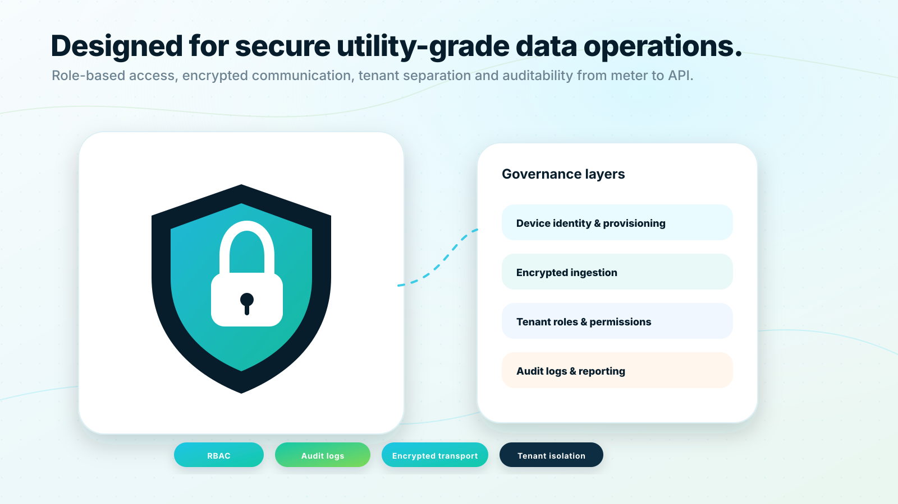

**SEO title:** Water Meter Data Security and Governance | QualMeters Oy
**Meta description:** QualMeters is designed for secure water data operations with encrypted communication, role-based access, tenant separation and audit logs.

### Hero

**Eyebrow:** Security and data governance

**H1:** Water data needs infrastructure-grade trust.

**Hero body:** QualMeters protects meter data from the device layer to dashboards and APIs. The platform uses encrypted communication, role-based access, tenant separation, audit logs and privacy-aware resident features.

### Section: Security principles

**Encrypt data in transit:** Gateway and NB-IoT ingestion paths use secure transport.
**Separate tenants:** Each organization sees only its authorized meters, apartments and properties.
**Control access:** Roles define what residents, property managers, municipal users, support teams and administrators can see.
**Audit sensitive actions:** Log API access, account changes, device changes and data export activity.
**Minimize personal data:** Store only what is needed for the service and resident experience.
**Protect comparison features:** Use aggregated peer groups and privacy thresholds before showing benchmark data.

### Section: Resident access governance

QR-based access is user-friendly, and the service protects against guessing and misuse. Safeguards include rate limiting, temporary access tokens, confirmation of current visible reading, optional resident account creation, property manager-controlled invitations and logging of access attempts.

### CTA

**Headline:** Review security before procurement starts.
**Button:** Request security overview

---

## 4.17 `/about` — About QualMeters


**SEO title:** About QualMeters Oy | Smart Water Metering Company
**Meta description:** QualMeters Oy provides smart water metering systems for buildings, municipalities and property portfolios.

### Hero

**Eyebrow:** About QualMeters

**H1:** We build water metering systems for a more transparent built environment.

**Hero body:** QualMeters Oy was created to help buildings, municipalities and property portfolios move from manual water reading to reliable water intelligence. Our approach combines accurate metering hardware, modern connectivity, cloud software and resident-facing transparency.

### Mission

To make water consumption measurable, understandable and actionable for every stakeholder — from the resident reading their own meter to the municipality planning water demand.

### What we believe

**Water data is trustworthy.** Accurate measurement and clear data quality matter.
**Residents understand their own consumption.** Visibility supports fairness and better habits.
**Organizations stay free from one communication model.** The platform supports common protocols and additional adapters.
**Sustainability is practical.** Leak awareness, benchmarking and clear feedback create measurable progress.

### Company details

QualMeters Oy
Muonamiehentie 11
00390 Helsinki
Finland

### CTA

**Headline:** Meet the team building the QualMeters platform.
**Button:** Contact us

---

## 4.18 `/contact` — Contact

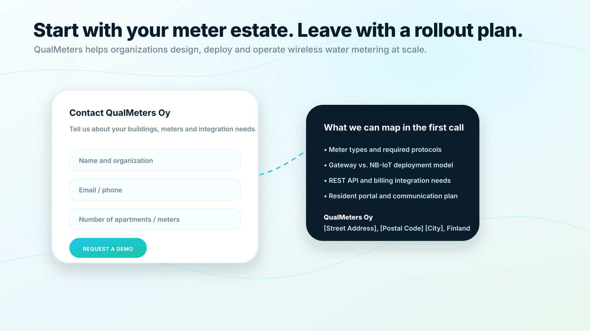

**SEO title:** Contact QualMeters Oy | Request a Smart Water Metering Demo
**Meta description:** Contact QualMeters Oy to discuss wireless water metering, ultrasonic meters, gateway deployments, NB-IoT devices, resident portals and REST API integrations.

### Hero

**Eyebrow:** Contact sales

**H1:** Start with your meter estate. Leave with a rollout plan.

**Hero body:** Tell us about your buildings, meter count, communication requirements and integration needs. QualMeters will help you identify the right deployment model and next steps.

### Contact form fields

- Name
- Organization
- Email
- Phone
- Organization type: housing company, municipality, city, developer, property portfolio, other
- Number of buildings
- Estimated number of apartments or meters
- Current meter type or protocol if known
- Preferred deployment: gateway, NB-IoT, not sure
- Message

### Contact details

QualMeters Oy
Muonamiehentie 11
00390 Helsinki
Finland

Email: sales@qualmeters.com
Phone: +358 40 580 4819

### CTA button

**Request a demo**

### Sales page supporting copy

**What we can map in the first call:**

- Your building and meter estate
- Cold and warm water metering requirements
- Gateway versus NB-IoT deployment model
- REST API and billing integration requirements
- Resident portal and onboarding approach
- Pilot scope and rollout roadmap

---

## 4.19 `/faq` — FAQ


**SEO title:** Smart Water Metering FAQ | QualMeters Oy
**Meta description:** Answers to common questions about QualMeters smart water metering, ultrasonic meters, connectivity, resident portals, leak alerts and REST APIs.

### What does QualMeters provide?

QualMeters provides a managed smart water metering system: ultrasonic water meters, communication infrastructure, cloud software, resident portals, alerts and API access.

### Do you support both cold and warm water?

Yes. The system is designed for apartment-level cold and warm water metering. New apartment buildings often require two meters per apartment: one for cold water and one for warm water.

### What communication methods do you support?

QualMeters supports common metering communication methods including Wireless M-Bus, Modbus and NB-IoT. Additional adapters can be added based on project requirements.

### Do we need a building gateway?

Not always. A building gateway is useful when many local meters are collected through Wireless M-Bus, Modbus or similar technologies. NB-IoT meters can send data directly to the QualMeters cloud when direct cellular communication is the preferred model.

### Can residents see their own consumption?

Yes. Residents can access their own meter view through a portal. Access uses the QR code on the meter and current meter reading verification.

### Can organizations access the data through an API?

Yes. Cities, municipalities, housing companies and property owners can access data through a REST API, subject to authorization and integration scope.

### Does the system include leak detection?

Yes. Leak Guard is specified to detect abnormal patterns such as continuous flow, nighttime consumption and sudden spikes. Alert rules can be configured by organization, property and meter type.

### How does consumption comparison work?

Residents can compare their water use against suitable peer groups. Better comparison data can be provided when users add optional context such as household size. Comparison features use anonymized and aggregated data.

### Is QualMeters suitable for new buildings?

Yes. New buildings are ideal for early smart metering specification because meter locations, communication infrastructure, gateway placement and data handover can be planned before installation.

### Is QualMeters suitable for existing buildings?

Yes. Existing buildings can be evaluated for retrofit using gateway-based collection, NB-IoT meters or a mixed deployment model depending on meter type and network conditions.

---

# 5. Internal Product Specification Implied by the Website

This section is not necessarily public website copy. It translates the website promise into recommended product capabilities so the system can be built consistently.

## 5.1 MVP capability set

### Meter and device registry

- Meter serial number
- Meter type and manufacturer
- MID metadata
- Temperature class: T50/T90
- Cold/warm water classification
- Apartment, building, property and organization association
- Installation date and installer information
- Communication method: Wireless M-Bus, Modbus, NB-IoT or other
- Device status and last reading timestamp

### Data ingestion

- Gateway ingestion endpoint
- NB-IoT device ingestion endpoint or operator integration
- Duplicate reading detection
- Time synchronization handling
- Reading quality flags
- Store-and-forward support for gateway data
- Error handling and device silence detection

### Resident portal

- QR code meter opening
- Current-reading verification
- Resident account option
- Daily, weekly, monthly and yearly consumption views
- Cold and warm water combined and separate views
- Leak and abnormal consumption notices
- Optional household profile for better benchmarking

### Organization portal

- Organization hierarchy: organization → portfolio → property → building → apartment → meter
- Meter list and search
- Latest readings
- Reading history
- Alert list
- Device health
- Export tools
- User management and roles

### REST API

- OAuth 2.0 client credentials
- Tenant-scoped access
- API keys only for restricted technical use if required
- Versioned endpoints
- Pagination, filtering and sorting
- Reading quality metadata
- Audit logs
- Webhook support for alerts in later MVP expansion

### Leak Guard

- Continuous flow detection
- Nighttime use detection
- Sudden spike detection
- Missing reading alert
- Configurable thresholds by meter type and property
- Alert acknowledgement and status tracking

## 5.2 Enterprise roadmap

### Advanced analytics

- Household-size-aware benchmarking
- Building and portfolio water efficiency scores
- Seasonal consumption baselines
- Predictive leak risk patterns
- Device failure prediction
- Meter replacement prioritization

### Integration expansion

- Billing system connectors
- ERP connectors
- Property management connectors
- Municipal data warehouse integration
- Webhook subscriptions
- Batch exports and scheduled reports

### Operations expansion

- Installer mobile workflow
- Commissioning checklist
- Meter replacement workflow
- Gateway remote update management
- Device firmware tracking
- SLA dashboards

### Security expansion

- SSO/SAML for enterprise organizations
- Fine-grained API scopes
- Data residency options
- Automated compliance reporting
- Advanced audit search
- Security event monitoring

## 5.3 Recommended data objects

### Organization

Represents a housing company, municipality, city, property company or portfolio owner.

### Property

Represents a property or site. A property may contain one or more buildings.

### Building

Represents a physical building with gateway information, floors and apartments.

### Apartment

Represents a residential unit or other metered unit.

### Meter

Represents a physical water meter. A meter belongs to an apartment, common area or technical system.

### Reading

Represents a measured water volume at a point in time, including quality and source metadata.

### Alert

Represents a leak, abnormal consumption, device silence or operational issue.

### Gateway

Represents an on-site data collection device with network, firmware and health metadata.

### Resident profile

Represents a resident portal user and optional benchmarking context. Store minimal personal information and separate it from metering data where possible.

## 5.4 Suggested non-functional requirements

- High availability for ingestion and API access
- Secure transport for all device and user communication
- Tenant separation at application and data access layers
- Audit logs for data access and administrative actions
- GDPR-aligned data minimization and retention controls
- Scalable storage for interval readings
- Backpressure handling for gateway batch uploads
- API rate limiting and abuse protection
- Clear data export and portability options
- Monitoring of data freshness and device health

---

# 6. Homepage Component Outline

This is the recommended component order for the final website implementation.

1. Header with logo, navigation and **Request a demo** button
2. Hero section with `hero-smart-water-network.svg`
3. Trust strip: Housing companies | Municipalities | Cities | Property portfolios | Developers
4. “One complete system” feature section
5. Architecture preview with `system-architecture.svg`
6. Meter hardware highlight with `ultrasonic-meter-pair.svg`
7. Resident portal preview with `resident-portal-qr.svg`
8. Organization data/API preview with `utility-dashboard-api.svg`
9. Leak Guard section with `leak-guard.svg`
10. Sustainability and benchmarking section with `sustainability-benchmarking.svg`
11. Deployment lifecycle with `deployment-lifecycle.svg`
12. Security and governance strip with `security-governance.svg`
13. Final contact CTA with `contact-sales-channel.svg`
14. Footer with company address, quick links and sales contact

---

# 7. Navigation Labels

**Main navigation:**

- Platform
- Meters
- Solutions
- Resident Portal
- REST API
- Sustainability
- Contact

**Platform dropdown:**

- Platform overview
- Connectivity
- Building gateway
- Cloud platform
- Security
- Deployment

**Solutions dropdown:**

- Housing companies
- Cities and municipalities
- New apartment buildings
- Property portfolios

**Footer columns:**

**Platform:** Platform overview, Connectivity, Gateway, Cloud platform, REST API
**Solutions:** Housing companies, Cities and municipalities, New developments, Property portfolios
**Resources:** FAQ, Deployment, Security, Sustainability
**Company:** About, Contact

---

# 8. Contact and Sales Channel Copy

Use this contact block globally at the bottom of most pages.


**Headline:** Ready to see what your water data could become?

**Body:** Share your building type, meter count, communication requirements and integration needs. QualMeters will help you map the right deployment model and next steps.

**Button:** Request a demo

**Microcopy:** No obligation. We will start by understanding your existing meters, buildings and goals.

---

# 9. Research-Informed Direction

The content direction above is based on common capabilities found in leading smart water metering and meter data management systems worldwide. The goal is not to copy any single provider, but to position QualMeters at the same enterprise category level.

Key market patterns used for the QualMeters content model:

1. **Meter data management as SaaS:** Leading systems present web-based meter data management with dashboards, alarm monitoring, analysis tools and integrations. Diehl Metering’s IZAR PLUS Portal describes a web-based MDM application with fixed network and walk-by/drive-by data management, dashboards, alarm monitoring and REST API integration.
   Source: [Diehl Metering — IZAR PLUS Portal](https://www.diehl.com/metering/en/products-solutions/products/software-system-components/izar-plus-portal-de/)

2. **Utility management plus consumer engagement:** Badger Meter’s BEACON platform is positioned as cloud-based SaaS for utility management and consumer engagement, using interval meter data from cellular, fixed-network or mobile communication technologies.
   Source: [Badger Meter — BEACON](https://www.badgermeter.com/products/analytics-software/beacon/)

3. **NB-IoT as a smart metering option:** NB-IoT is commonly used for low-power, large-scale, deep-indoor smart metering scenarios. Kamstrup describes NB-IoT benefits such as low data rates, reliable coverage in challenging environments, long battery life, large-scale deployments and deep indoor coverage.
   Source: [Kamstrup — Understanding NB-IoT for water management](https://www.kamstrup.com/en-en/insights/nb-iot-smart-water-technology)

4. **Leak reduction and operational analytics:** Itron’s Temetra Analysis messaging focuses on operational visibility, minimizing leaks, pressure management, labor reduction and improved customer experience.
   Source: [Itron — Temetra Analysis](https://na.itron.com/products/temetra-analysis)

5. **Customer engagement, billing data and leak detection:** Xylem describes Sensus Analytics as supporting billing data access, reporting, leak detection, customer engagement and pressure monitoring.
   Source: [Xylem — Sensus Analytics for Water Utilities](https://www.xylem.com/fi-fi/resources/videos/sensus-analytics-for-water-utilities/)

6. **Smart meter programs remove manual reading and help customers manage usage:** Singapore’s PUB describes smart water meters that automatically record readings several times a day, transmit data remotely and allow customers to view daily usage.
   Source: [PUB Singapore — Smart Water Meter](https://www.pub.gov.sg/Public/KeyInitiatives/Smart-Water-Meter)

7. **Building and sub-metering intelligence:** Smartvatten positions real-time building water monitoring for leak detection and sub-metering for fair billing and detailed insights.
   Source: [Smartvatten — Main meter intelligence and sub-metering](https://smartvatten.com/en)

8. **MID relevance:** The European Commission identifies water meters as measuring instruments and describes the Measuring Instruments Directive as setting essential technical requirements for multiple instrument categories.
   Source: [European Commission — Measuring & weighing instruments in the EU](https://single-market-economy.ec.europa.eu/single-market/goods/building-blocks/legal-metrology/measuring-weighing-instruments-eu_en)

---

# 10. Publication Notes

Before publishing the final website, validate the following business and technical details:

- Final meter models, manufacturers and exact MID certificate wording
- Confirmed protocol support and adapter availability
- Whether all pages should say “real-time” or “near real-time” depending on reading frequency
- Production authentication model for resident portal access
- Data retention terms and privacy policy wording
- API availability, rate limits and supported endpoints
- Service level commitments and support channels
- Confirmed company address, email and phone number
- Whether pricing is shown publicly or handled through sales consultation
